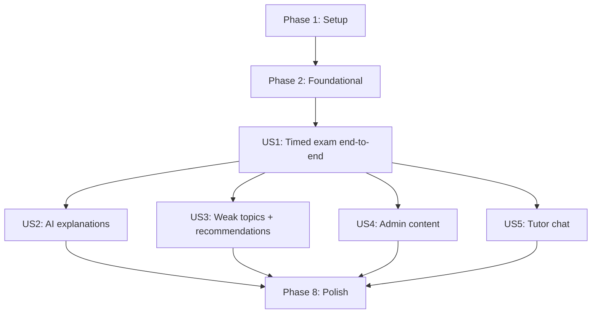

# Tasks: Azure AI Certification Practice Assessment Platform (MVP)

**Input**: Design documents from `/specs/001-practice-assessment/`
**Prerequisites**: plan.md (required), spec.md (required for user stories), research.md, data-model.md, contracts/

**Tests**: Tests are REQUIRED when a feature touches critical paths (auth, attempt lifecycle, scoring, submission) and SHOULD be included for contract changes.

**Organization**: Tasks are grouped by user story to enable independent implementation and testing of each story.

## Format: `[ID] [P?] [Story] Description`

- **[P]**: Can run in parallel (different files, no dependencies)
- **[Story]**: Which user story this task belongs to (e.g., US1, US2, US3)
- Each task includes an exact file path

---

## Phase 1: Setup (Shared Infrastructure)

**Purpose**: Create the monorepo scaffolding, CI, and local dev basics.

- [X] T001 Create repo directories `apps/api`, `apps/web`, `docs/`, `infra/` and baseline files in README.md
- [X] T002 [P] Add root `.editorconfig` and `.gitignore` for Node/Python/Next/FastAPI in .editorconfig and .gitignore
- [X] T003 [P] Add Docker Compose skeleton for PostgreSQL in docker-compose.yml
- [X] T004 [P] Add repo environment examples in .env.example and apps/api/.env.example and apps/web/.env.example
- [X] T005 [P] Add Python lint config in apps/api/pyproject.toml (ruff + pytest config)
- [X] T006 [P] Add Node tooling placeholders in apps/web/package.json scripts (dev/test/lint) in apps/web/package.json
- [X] T007 [P] Add pre-commit hooks config in .pre-commit-config.yaml
- [X] T008 [P] Add GitHub Actions CI skeleton for API in .github/workflows/api-ci.yml
- [X] T009 [P] Add GitHub Actions CI skeleton for Web in .github/workflows/web-ci.yml

**Checkpoint**: Repo boots with empty apps and CI pipelines exist.

---

## Phase 2: Foundational (Blocking Prerequisites)

**Purpose**: Establish backend + frontend bootstraps, DB/migrations, and shared cross-cutting behavior.

### API foundation

- [X] T010 Create FastAPI app entrypoint in apps/api/src/main.py
- [X] T011 [P] Add API settings management in apps/api/src/core/settings.py
- [X] T012 [P] Add structured logging setup in apps/api/src/core/logging.py
- [X] T013 [P] Add error envelope types in apps/api/src/core/errors.py
- [X] T014 Add global exception handlers returning the error envelope in apps/api/src/main.py
- [X] T015 [P] Add health check router in apps/api/src/api/routers/health.py
- [X] T016 Register API router and /healthz endpoint in apps/api/src/main.py

### Database + migrations

- [X] T017 [P] Add SQLAlchemy engine + session factory in apps/api/src/db/session.py
- [X] T018 [P] Add SQLAlchemy base model registry in apps/api/src/db/base.py
- [X] T019 [P] Initialize Alembic config in apps/api/alembic.ini and apps/api/alembic/env.py
- [X] T020 Add initial Alembic migration scaffold in apps/api/alembic/versions/0001_init.py

### Auth primitives (no UI yet)

- [X] T021 [P] Add password hashing utility (Argon2id) in apps/api/src/utils/passwords.py
- [X] T022 [P] Add JWT utility (sign/verify) in apps/api/src/utils/jwt.py
- [X] T023 [P] Add current-user dependency helper in apps/api/src/utils/auth.py
- [X] T024 [P] Add admin-guard dependency helper in apps/api/src/utils/admin.py

### Web foundation

- [ ] T025 Initialize Next.js 15 app shell in apps/web/src/app/layout.tsx
- [ ] T026 [P] Configure TailwindCSS + globals in apps/web/src/styles/globals.css
- [ ] T027 [P] Add ShadCN UI base components used by the app in apps/web/src/components/ui/button.tsx and apps/web/src/components/ui/card.tsx
- [ ] T028 [P] Add theme toggle component in apps/web/src/components/theme-toggle.tsx
- [ ] T029 [P] Add API client wrapper in apps/web/src/lib/api-client.ts
- [ ] T030 [P] Add auth session helper (cookie-based) in apps/web/src/lib/auth.ts
- [ ] T031 [P] Add route guard layout wrapper in apps/web/src/components/route-guard.tsx
- [ ] T032 [P] Add Zustand store scaffold for attempt runner in apps/web/src/stores/attempt-store.ts

**Checkpoint**: API runs locally, connects to Postgres, and Web renders a polished shell with dark mode.

---

## Phase 3: User Story 1 — Timed practice exam end-to-end (Priority: P1) MVP

**Goal**: Learner can sign up/log in, browse exams, take a timed attempt with autosave, submit/expire, and see a deterministic score breakdown.

**Independent Test**: A learner can complete a full attempt end-to-end in the UI and the API tests validate auth + attempt lifecycle + scoring.

### Tests for User Story 1 (REQUIRED)

- [ ] T033 [P] [US1] Add API integration tests for signup/login/me in apps/api/tests/integration/test_auth.py
- [ ] T034 [P] [US1] Add API integration tests for attempt start and one-active-attempt rule in apps/api/tests/integration/test_attempt_start.py
- [ ] T035 [P] [US1] Add API integration tests for autosave responses and expiry behavior in apps/api/tests/integration/test_attempt_autosave.py
- [ ] T036 [P] [US1] Add API integration tests for submit + deterministic scoring in apps/api/tests/integration/test_attempt_submit_and_score.py
- [ ] T037 [P] [US1] Add Web E2E test: login → start exam → answer → submit → results in apps/web/tests/e2e/exam-runner.spec.ts

### Backend implementation (US1)

- [ ] T038 [P] [US1] Implement SQLAlchemy User model in apps/api/src/models/user.py
- [ ] T039 [P] [US1] Implement SQLAlchemy Exam model in apps/api/src/models/exam.py
- [ ] T040 [P] [US1] Implement SQLAlchemy Question model in apps/api/src/models/question.py
- [ ] T041 [P] [US1] Implement SQLAlchemy Option model in apps/api/src/models/option.py
- [ ] T042 [P] [US1] Implement SQLAlchemy Attempt model in apps/api/src/models/attempt.py
- [ ] T043 [P] [US1] Implement SQLAlchemy AttemptResponse model in apps/api/src/models/attempt_response.py
- [ ] T044 [US1] Register model imports in apps/api/src/db/base.py (metadata discovery)
- [ ] T045 [US1] Create Alembic migration for core tables in apps/api/alembic/versions/0002_core_tables.py
- [ ] T046 [P] [US1] Add Pydantic schemas for auth/user in apps/api/src/schemas/auth.py
- [ ] T047 [P] [US1] Add Pydantic schemas for exams/questions in apps/api/src/schemas/exams.py
- [ ] T048 [P] [US1] Add Pydantic schemas for attempts/results in apps/api/src/schemas/attempts.py
- [ ] T049 [P] [US1] Add UserRepository in apps/api/src/repositories/user_repository.py
- [ ] T050 [P] [US1] Add ExamRepository in apps/api/src/repositories/exam_repository.py
- [ ] T051 [P] [US1] Add QuestionRepository in apps/api/src/repositories/question_repository.py
- [ ] T052 [P] [US1] Add AttemptRepository in apps/api/src/repositories/attempt_repository.py
- [ ] T053 [P] [US1] Add AttemptResponseRepository in apps/api/src/repositories/attempt_response_repository.py
- [ ] T054 [US1] Implement AuthService (signup/login/me) in apps/api/src/services/auth_service.py
- [ ] T055 [US1] Implement ExamService (list/get) in apps/api/src/services/exam_service.py
- [ ] T056 [US1] Implement AttemptService (start/autosave/submit/expire) in apps/api/src/services/attempt_service.py
- [ ] T057 [US1] Implement deterministic scoring helper in apps/api/src/services/scoring.py
- [ ] T058 [P] [US1] Implement auth router in apps/api/src/api/routers/auth.py
- [ ] T059 [P] [US1] Implement exams router in apps/api/src/api/routers/exams.py
- [ ] T060 [P] [US1] Implement questions router in apps/api/src/api/routers/questions.py
- [ ] T061 [P] [US1] Implement attempts router in apps/api/src/api/routers/attempts.py
- [ ] T062 [US1] Register all routers in apps/api/src/api/router.py
- [ ] T063 [US1] Wire API router into FastAPI app in apps/api/src/main.py
- [ ] T064 [P] [US1] Add demo seed script (exam + 20+ questions + admin user) in apps/api/src/db/seed_demo.py
- [ ] T065 [US1] Add CLI entrypoint for seeding in apps/api/src/scripts/seed.py

### Frontend implementation (US1)

- [ ] T066 [P] [US1] Build login page in apps/web/src/app/(auth)/login/page.tsx
- [ ] T067 [P] [US1] Build signup page in apps/web/src/app/(auth)/signup/page.tsx
- [ ] T068 [P] [US1] Add auth React Query mutations in apps/web/src/lib/auth-queries.ts
- [ ] T069 [P] [US1] Add protected dashboard page shell in apps/web/src/app/dashboard/page.tsx
- [ ] T070 [P] [US1] Build exam list page in apps/web/src/app/exams/page.tsx
- [ ] T071 [P] [US1] Build exam detail page in apps/web/src/app/exams/[examId]/page.tsx
- [ ] T072 [P] [US1] Add exams queries in apps/web/src/lib/exam-queries.ts
- [ ] T073 [P] [US1] Build attempt runner route in apps/web/src/app/attempts/[attemptId]/page.tsx
- [ ] T074 [P] [US1] Implement Timer component in apps/web/src/components/attempt/timer.tsx
- [ ] T075 [P] [US1] Implement QuestionCard component in apps/web/src/components/attempt/question-card.tsx
- [ ] T076 [P] [US1] Implement OptionList component in apps/web/src/components/attempt/option-list.tsx
- [ ] T077 [P] [US1] Implement QuestionPalette component in apps/web/src/components/attempt/question-palette.tsx
- [ ] T078 [P] [US1] Implement ProgressBar component in apps/web/src/components/attempt/progress-bar.tsx
- [ ] T079 [P] [US1] Implement MarkForReview toggle in apps/web/src/components/attempt/mark-for-review.tsx
- [ ] T080 [US1] Implement attempt state orchestration (Zustand + React Query) in apps/web/src/stores/attempt-store.ts
- [ ] T081 [P] [US1] Add autosave mutation hook in apps/web/src/lib/attempt-mutations.ts
- [ ] T082 [US1] Add resume-on-refresh behavior in apps/web/src/app/attempts/[attemptId]/page.tsx
- [ ] T083 [P] [US1] Add submission confirmation modal in apps/web/src/components/attempt/submit-modal.tsx
- [ ] T084 [US1] Wire submission flow to API in apps/web/src/lib/attempt-mutations.ts
- [ ] T085 [US1] Build results page in apps/web/src/app/attempts/[attemptId]/result/page.tsx
- [ ] T086 [US1] Render deterministic per-question breakdown in apps/web/src/components/result/question-breakdown.tsx

**Checkpoint**: US1 demo-ready MVP (auth + exam runner + submit + deterministic results).

---

## Phase 4: User Story 2 — AI-assisted explanations (Priority: P2)

**Goal**: After submission, learner can request AI explanations for questions; failures degrade gracefully and scoring is unchanged.

**Independent Test**: A submitted attempt can request an explanation per question, the explanation persists, and score/correctness stays deterministic.

### Tests for User Story 2

- [ ] T087 [P] [US2] Add unit tests for explanation prompt formatting in apps/api/tests/unit/test_ai_explanations_prompt.py
- [ ] T088 [P] [US2] Add API integration test for /ai/explanations with stubbed AI client in apps/api/tests/integration/test_ai_explanations.py
- [ ] T089 [P] [US2] Add Web unit test for explanation panel loading/error states in apps/web/tests/unit/explanation-panel.test.tsx

### Implementation (US2)

- [ ] T090 [P] [US2] Add AIExplanation SQLAlchemy model in apps/api/src/models/ai_explanation.py
- [ ] T091 [P] [US2] Add Pydantic schemas for explanations in apps/api/src/schemas/ai.py
- [ ] T092 [P] [US2] Add Azure OpenAI client wrapper in apps/api/src/utils/azure_openai_client.py
- [ ] T093 [P] [US2] Add explanation prompt template in apps/api/src/services/ai/prompts/explanations.py
- [ ] T094 [US2] Implement AIService explanation generation + validation in apps/api/src/services/ai_service.py
- [ ] T095 [P] [US2] Implement AI router endpoints in apps/api/src/api/routers/ai.py
- [ ] T096 [US2] Register AI router in apps/api/src/api/router.py
- [ ] T097 [US2] Create Alembic migration for AIExplanation in apps/api/alembic/versions/0003_ai_explanations.py
- [ ] T098 [P] [US2] Add AI explanation panel UI in apps/web/src/components/result/ai-explanation-panel.tsx
- [ ] T099 [P] [US2] Add React Query mutation for explanations in apps/web/src/lib/ai-mutations.ts
- [ ] T100 [US2] Wire explanation panel into results page in apps/web/src/app/attempts/[attemptId]/result/page.tsx

---

## Phase 5: User Story 3 — Weak topics + study recommendations (Priority: P3)

**Goal**: Learner can see weak topics derived from attempts and request AI-assisted study recommendations.

**Independent Test**: Weak-topic aggregation is deterministic; AI recommendations render but do not block deterministic analytics.

### Tests for User Story 3

- [ ] T101 [P] [US3] Add unit tests for weak-topic aggregation in apps/api/tests/unit/test_analytics_weak_topics.py
- [ ] T102 [P] [US3] Add API integration tests for analytics endpoints in apps/api/tests/integration/test_analytics_endpoints.py
- [ ] T103 [P] [US3] Add API integration test for /ai/recommendations with stubbed AI client in apps/api/tests/integration/test_ai_recommendations.py

### Implementation (US3)

- [ ] T104 [P] [US3] Implement analytics aggregation in apps/api/src/services/analytics_service.py
- [ ] T105 [P] [US3] Implement analytics router in apps/api/src/api/routers/analytics.py
- [ ] T106 [US3] Register analytics router in apps/api/src/api/router.py
- [ ] T107 [P] [US3] Add AIRecommendation SQLAlchemy model in apps/api/src/models/ai_recommendation.py
- [ ] T108 [P] [US3] Add recommendation prompt template in apps/api/src/services/ai/prompts/recommendations.py
- [ ] T109 [US3] Extend AIService for recommendations in apps/api/src/services/ai_service.py
- [ ] T110 [US3] Create Alembic migration for AIRecommendation in apps/api/alembic/versions/0004_ai_recommendations.py
- [ ] T111 [P] [US3] Add weak topics card UI in apps/web/src/components/result/weak-topics-card.tsx
- [ ] T112 [P] [US3] Add recommendations panel UI in apps/web/src/components/result/recommendations-panel.tsx
- [ ] T113 [P] [US3] Add analytics queries in apps/web/src/lib/analytics-queries.ts
- [ ] T114 [P] [US3] Add recommendations mutation in apps/web/src/lib/ai-mutations.ts
- [ ] T115 [US3] Wire weak topics + recommendations into results page in apps/web/src/app/attempts/[attemptId]/result/page.tsx
- [ ] T116 [US3] Build analytics dashboard page in apps/web/src/app/analytics/page.tsx

---

## Phase 6: User Story 4 — Admin content management (Priority: P4)

**Goal**: Admin can manage exams/questions; non-admin users are denied.

**Independent Test**: Admin CRUD works via API and UI; non-admin access is blocked.

### Tests for User Story 4

- [ ] T117 [P] [US4] Add API integration tests for admin gating in apps/api/tests/integration/test_admin_authz.py
- [ ] T118 [P] [US4] Add API integration tests for exam CRUD in apps/api/tests/integration/test_admin_exams_crud.py
- [ ] T119 [P] [US4] Add API integration tests for question CRUD + validation in apps/api/tests/integration/test_admin_questions_crud.py

### Implementation (US4)

- [ ] T120 [US4] Implement admin exam CRUD in apps/api/src/api/routers/exams.py
- [ ] T121 [US4] Implement admin question CRUD in apps/api/src/api/routers/questions.py
- [ ] T122 [US4] Add server-side validation for question options (>=2, exactly 1 correct) in apps/api/src/services/question_service.py
- [ ] T123 [P] [US4] Build admin exams page in apps/web/src/app/admin/exams/page.tsx
- [ ] T124 [P] [US4] Build admin exam form component in apps/web/src/components/admin/exam-form.tsx
- [ ] T125 [P] [US4] Build admin questions page in apps/web/src/app/admin/questions/page.tsx
- [ ] T126 [P] [US4] Build question form component in apps/web/src/components/admin/question-form.tsx
- [ ] T127 [P] [US4] Add admin API hooks in apps/web/src/lib/admin-queries.ts

---

## Phase 7: User Story 5 — AI tutor chat (Priority: P5)

**Goal**: Learner can chat with a lightweight tutor, optionally contextualized by attempt/question.

**Independent Test**: Tutor can respond and persist chat history without affecting attempt scoring.

### Tests for User Story 5

- [ ] T128 [P] [US5] Add unit tests for tutor prompt formatting in apps/api/tests/unit/test_ai_tutor_prompt.py
- [ ] T129 [P] [US5] Add API integration test for /ai/tutor/chat with stubbed AI client in apps/api/tests/integration/test_ai_tutor_chat.py

### Implementation (US5)

- [ ] T130 [P] [US5] Add TutorConversation model in apps/api/src/models/tutor_conversation.py
- [ ] T131 [P] [US5] Add TutorMessage model in apps/api/src/models/tutor_message.py
- [ ] T132 [P] [US5] Add tutor schemas in apps/api/src/schemas/tutor.py
- [ ] T133 [P] [US5] Add tutor prompt template in apps/api/src/services/ai/prompts/tutor.py
- [ ] T134 [US5] Extend AIService for tutor chat + persistence in apps/api/src/services/ai_service.py
- [ ] T135 [US5] Create Alembic migration for tutor chat tables in apps/api/alembic/versions/0005_tutor_chat.py
- [ ] T136 [P] [US5] Build tutor chat drawer UI in apps/web/src/components/tutor/tutor-drawer.tsx
- [ ] T137 [P] [US5] Add tutor chat mutation hook in apps/web/src/lib/ai-mutations.ts
- [ ] T138 [US5] Wire tutor drawer into results page in apps/web/src/app/attempts/[attemptId]/result/page.tsx

---

## Phase 8: Polish & Cross-Cutting Concerns

**Purpose**: Improve reliability, documentation, and deployment readiness.

- [ ] T139 [P] Add OpenAPI and API docs pointers in docs/api/README.md
- [ ] T140 [P] Add architecture overview doc in docs/architecture/overview.md
- [ ] T141 Add Dockerfile for API in apps/api/Dockerfile
- [ ] T142 Add Dockerfile for Web in apps/web/Dockerfile
- [ ] T143 Update docker-compose.yml to run api + web + db together
- [ ] T144 [P] Add production config notes in docs/architecture/deployment.md
- [ ] T145 [P] Add basic rate limiting middleware for auth + AI routes in apps/api/src/core/rate_limit.py
- [ ] T146 [P] Add end-to-end smoke test script notes in specs/001-practice-assessment/quickstart.md

---

## Dependencies & Execution Order

### Dependency Graph (recommended)



### Phase Dependencies

- **Setup (Phase 1)**: No dependencies
- **Foundational (Phase 2)**: Depends on Setup completion; blocks all user stories
- **User Stories (Phase 3–7)**: Depend on Foundational completion; implement in priority order for a solo MVP
- **Polish (Phase 8)**: Depends on desired user stories being complete

### User Story Dependencies (recommended)

- **US1 (P1)**: Foundation for everything else; implement first
- **US2 (P2)**: Depends on US1 submission/results existing
- **US3 (P3)**: Depends on US1 attempt/result data; recommendations can follow
- **US4 (P4)**: Depends on auth + core models; can be started after US1 basics
- **US5 (P5)**: Depends on auth; optionally benefits from result context (US1)

### Parallel Opportunities

- Phase 1 tasks marked [P] can run in parallel
- In US1, model/repository/schema tasks are parallelizable across files
- Frontend components for the runner can be built in parallel once the route shell exists

---

## Parallel Example: User Story 1

```bash
Task: "Implement SQLAlchemy User model in apps/api/src/models/user.py"
Task: "Implement SQLAlchemy Exam model in apps/api/src/models/exam.py"
Task: "Implement SQLAlchemy Question model in apps/api/src/models/question.py"
Task: "Implement SQLAlchemy Option model in apps/api/src/models/option.py"
```

## Parallel Example: User Story 2

```bash
Task: "Add AIExplanation SQLAlchemy model in apps/api/src/models/ai_explanation.py"
Task: "Add explanation prompt template in apps/api/src/services/ai/prompts/explanations.py"
Task: "Add AI explanation panel UI in apps/web/src/components/result/ai-explanation-panel.tsx"
```

## Parallel Example: User Story 3

```bash
Task: "Implement analytics router in apps/api/src/api/routers/analytics.py"
Task: "Add weak topics card UI in apps/web/src/components/result/weak-topics-card.tsx"
Task: "Add analytics queries in apps/web/src/lib/analytics-queries.ts"
```

## Parallel Example: User Story 4

```bash
Task: "Add API integration tests for exam CRUD in apps/api/tests/integration/test_admin_exams_crud.py"
Task: "Build admin exams page in apps/web/src/app/admin/exams/page.tsx"
Task: "Build question form component in apps/web/src/components/admin/question-form.tsx"
```

## Parallel Example: User Story 5

```bash
Task: "Add TutorMessage model in apps/api/src/models/tutor_message.py"
Task: "Add tutor prompt template in apps/api/src/services/ai/prompts/tutor.py"
Task: "Build tutor chat drawer UI in apps/web/src/components/tutor/tutor-drawer.tsx"
```

---

## Implementation Strategy

### MVP First (User Story 1 Only)

1. Complete Phase 1: Setup
2. Complete Phase 2: Foundational
3. Complete Phase 3: US1 end-to-end
4. Validate using API tests + Web E2E tests for US1

### Incremental Delivery

- Add US2 explanations → validate review UX + graceful failure
- Add US3 weak topics + recommendations → validate deterministic analytics
- Add US4 admin CRUD → validate admin gating
- Add US5 tutor chat → validate assistive-only behavior
